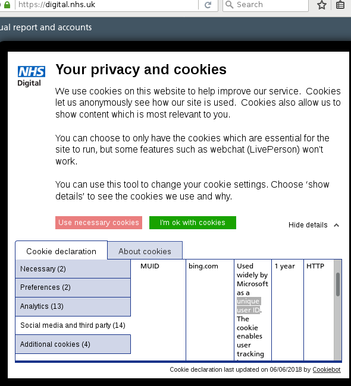

# NHS Digital Privacy Lies - 2nd July 2018
[NHS Digital](https://digital.nhs.uk/) - Open in a private browser in case you've already accepted this

## Summary

On the one hand their overlay states that you should use their cookies, because they're anonymous, but hidden details reavel that third parties are not as anonymous.

It overly simplifies privacy in its short context and if you want to understand then read the Exact Text below and then read the Hidden Details you have to expand.

### Check for
 - Pending? Really? They're hardly even trying to be compliant with GDPR.
 - User Id and Unique Id/Identifier 
 - Cookie types of pixel and HTML: they're just making these up

## The cookie banner

## The exact text

### Your privacy and cookies
We use cookies on this website to help improve our service.  Cookies let us anonymously see how our site is used.  Cookies also allow us to show content which is most relevant to you.  

You can choose to only have the cookies which are essential for the site to run, but some features such as webchat (LivePerson) won't work.  

You can use this tool to change your cookie settings. Choose ‘show details’ to see the cookies we use and why.

- Use necessary cookies
- I'm ok with cookies

# Hidden Details

#### About Cookies
Cookies are small text files that can be used by websites to make a user's experience more efficient.

The law states that we can store cookies on your device if they are strictly necessary for the operation of this site. For all other types of cookies we need your permission.

This site uses different types of cookies. Some cookies are placed by third party services that appear on our pages.

You can at any time change or withdraw your consent from the Cookie Declaration on our website.

You can find out more about who we are, how you can contact us and how we process personal data in our privacy policy.

##### Cookie Declaration

##### Necessary
These cookies enable basic functions like page navigation and access to secure areas of the website. Our website cannot function properly without these cookies.

| Name          | Provider            | Purpose                                                       | Expiry  | Type |
|---------------|---------------------|---------------------------------------------------------------|---------|------|
| CookieConsent | digital.nhs.uk      | Stores the user's cookie consent state for the current domain | 1 year  | HTTP |
| LPSessionID | | lo.v.liveperson.net | Preserves the visitor's session state across page requests.   | Session | HTTP |

##### Preferences
These cookies remember information that changes the way our website behaves or looks, like your preferred language or the region that you are in.

| Name              | Provider                                 | Purpose                                               | Expiry  | Type |
|-------------------|------------------------------------------|-------------------------------------------------------|---------|------|
|lpTestCookie# [x2] | digital.nhs.uk   lpcdn.lpsnmedia.net | Used to check if the user's browser supports cookies. | Session | HTTP |

##### Analytics
These cookies let us understand how visitors interact with our website by collecting and reporting information anonymously.

| Name                      | Provider                                                                          | Purpose                                                                                                                                                                                         | Expiry     | Type  |
|---------------------------|-----------------------------------------------------------------------------------|-------------------------------------------------------------------------------------------------------------------------------------------------------------------------------------------------|------------|-------|
| ai_user                   | app.powerbi.com                                                                   | Used by Microsoft Application Insights software to collect statistical usage and telemetry information. The cookie stores a unique identifier to recognize users on returning visits over time. | 1 year     | HTTP  |
| _ga                       | digital.nhs.uk                                                                    | Registers a unique ID that is used to generate statistical data on how the visitor uses the website.                                                                                            | 2 years    | HTTP  |
| _gat                      | digital.nhs.uk                                                                    | Used by Google Analytics to throttle request rate                                                                                                                                               | Session |    | HTTP  |
| _gid                      | digital.nhs.uk                                                                    | Registers a unique ID that is used to generate statistical data on how the visitor uses the website.                                                                                            | Session    | HTTP  |
| lpLastVisit-#             | digital.nhs.uk                                                                    | Used by LivePerson real time messaging platform to store the timestamp of the user's last visit.                                                                                                | Persistent | HTML  |
| LPVID                     | digital.nhs.uk                                                                    | Used by LivePerson real time messaging platform to recognize the visitor on returning visits.                                                                                                   | 2 years    | HTTP  |
| collect                   | google-analytics.com                                                              | Used to send data to Google Analytics about the visitor's device and behaviour. Tracks the visitor across devices and marketing channels.                                                       | Session    | Pixel |
| LPVisitorID               | lo.v.liveperson.net                                                               | Used by LivePerson real time messaging platform to recognize the visitor on returning visits.                                                                                                   | 1 year     | HTTP  |
| vuid                      | vimeo.com                                                                         | Collects data on the user's visits to the website, such as which pages have been read.                                                                                                          | 2 years    | HTTP  |
| @@History/@@scroll|# [x4] | app.powerbi.com   digital.nhs.uk   youtube.com   youtube-nocookie.com | Pending                                                                                                                                                                                         | Session    | HTML  |

##### Social Media and third party
These cookies are required by third party applications such as Power BI and our social media channels such as YouTube and Twitter.

| Name               | Provider        | Purpose                                                                                                                               | Expiry   | Type  |
|--------------------|-----------------|---------------------------------------------------------------------------------------------------------------------------------------|----------|-------|
| ai_session         | app.powerbi.com | Preserves users states across page requests.                                                                                          | Session  | HTTP  |
| MUID               | bing.com        | Used widely by Microsoft as a unique user ID. The cookie enables user tracking by synchronising the ID across many Microsoft domains. | 1 year   | HTTP  |
| NID                | google.com      | Registers a unique ID that identifies a returning user's device. The ID is used for targeted ads.                                     | 6 months | HTTP  |
| GPS                | youtube.com     | Registers a unique ID on mobile devices to enable tracking based on geographical GPS location.                                        | Session  | HTTP  |
| VISITOR_INFO1_LIVE | youtube.com     | Tries to estimate the users' bandwidth on pages with integrated YouTube videos.                                                       | 179 days | HTTP  |
| YSC                | youtube.com     | Registers a unique ID to keep statistics of what videos from YouTube the user has seen.                                               | Session  | HTTP  |
| _EDGE_S            | bing.com        | Pending                                                                                                                               | Session  | HTTP  |
| _EDGE_V            | bing.com        | Pending                                                                                                                               | 1 year   | HTTP  |
| _SS                | bing.com        | Pending                                                                                                                               | Session  | HTTP  |
| MUIDB              | bing.com        | Pending                                                                                                                               | 1 year   | HTTP  |
| SRCHD              | bing.com        | Pending                                                                                                                               | 1 year   | HTTP  |
| SRCHUID            | bing.com        | Pending                                                                                                                               | 1 year   | HTTP  |
| SRCHUSR            | bing.com        | Pending                                                                                                                               | 1 year   | HTTP  |
| r/collect          | doubleclick.net | Pending                                                                                                                               | Session  | Pixel | 

##### Additional cookies
These cookies are temporary or are required for our cookie tool to operate

| Name           | Provider                                    | Purpose | Expiry  | Type |
|----------------|---------------------------------------------|---------|---------|------|
| WFESessionId   | app.powerbi.com                             | Pending | Session | HTTP |
| BACKEND [x2]   | content.digital.nhs.uk   digital.nhs.uk | Pending | Session | HTTP |
| LPSID-35565217 | digital.nhs.uk                              | Pending | Session | HTTP |

